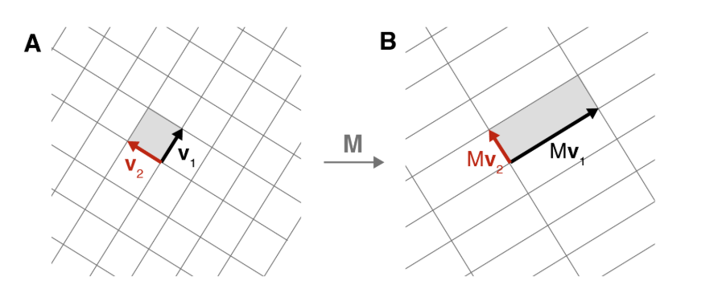

# Singular Value Decomposition (SVD) - Notes

## Core Definition

Any matrix M ∈ C^(m×n) can be decomposed as:

```
M = UΣV*
```

Where:

- **U**: m×m unitary matrix (left singular vectors)
- **Σ**: m×n diagonal matrix (singular values)
- **V**: n×n unitary matrix (right singular vectors)
- **V***: conjugate transpose of V

## Geometric Intuition

**Key Insight**: Any linear transformation can be viewed as:

1. Rotate the input space (V)
2. Scale/stretch along principal axes (Σ)  
3. Rotate the output space (U)

### Visual Understanding

- Transform a **square** → becomes a **rectangle** after proper rotations
- Transform a **circle** → becomes an **ellipse**
- Singular values = lengths of ellipse axes = amount of stretching

## Mathematical Derivation

### Step 1: Name the Components

 

For 2D case with orthonormal basis vectors v₁, v₂ (for the right-side space):

```
Mv₁ = u₁σ₁
Mv₂ = u₂σ₂
```

### Step 2: Express Any Vector

Any vector x can be written as:

```
x = (x·v₁)v₁ + (x·v₂)v₂
x = (x₁)v₁ + (x₂)v₂
```

### Step 3: Apply Transformation

```
Mx = (x·v₁)Mv₁ + (x·v₂)Mv₂
   = (x·v₁)u₁σ₁ + (x·v₂)u₂σ₂
   = u₁σ₁(v₁·x) + u₂σ₂(v₂·x) // since (x·v₁) is a scalar. It commutes too.
```

### Step 4: Remove x (since Ax = Bx ⟹ A = B)

```
M = u₁σ₁v₁* + u₂σ₂v₂*
```

### Step 5: Matrix Form

```
M = [u₁ u₂] [σ₁  0 ] [v₁*]
              [ 0 σ₂] [v₂*]
  = UΣV*
```

## General Form (m×n matrices)

```
MV = UΣ
MVV* = UΣV*
M = UΣV*
```

Where:

- U is m×m unitary
- Σ is m×n diagonal  
- V is n×n unitary
- VV* = I (orthonormal property)

## Key Properties

### Singular Values (diagonal elements of Σ)

- Ordered: σ₁ ≥ σ₂ ≥ ... ≥ σₙ ≥ 0
- **Geometric meaning**: Amount of stretching along each axis
- **Zero singular value**: Transformation flattens space (matrix is singular)
- **Largest singular value**: Maximum "action" of transformation

### Rank and Range

- **Rank**: Number of non-zero singular values
- **Range**: Spanned by {u₁, u₂, ..., uᵣ} where r = rank

## Application: Principal Component Analysis (PCA)

For data matrix X (n×p):

```
X = UΣV^T
```

Covariance matrix:

```
X^T X = (UΣV^T)^T (UΣV^T)
      = VΣ^T U^T UΣV^T
      = VΣ^T ΣV^T        (since U^T U = I)
      = VΣ²V^T
```

**PCA Insight**: SVD diagonalizes the covariance matrix, finding principal axes of data variation.

## Terminology

- **Left singular vectors**: Columns of U
- **Right singular vectors**: Columns of V  
- **Singular values**: Diagonal elements of Σ
- **Full SVD**: All singular values included
- **Truncated SVD**: Only top k singular values kept

## Geometric Summary

**Circle → Ellipse transformation**:

- Input circle (all radii equal)
- Output ellipse (major/minor axes = singular values)
- Radius stretched most = largest singular value
- SVD finds the "natural" coordinate system for any linear transformation
