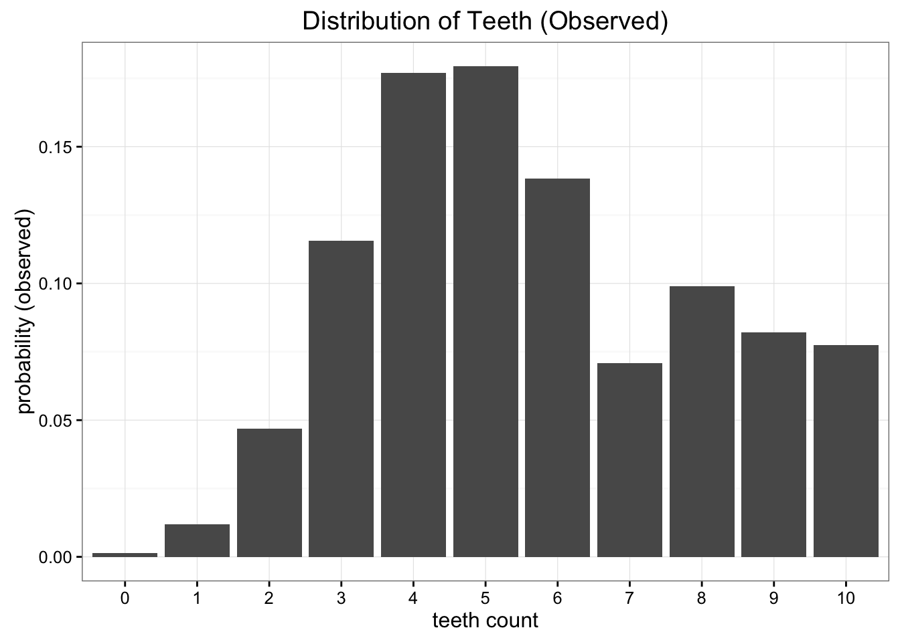
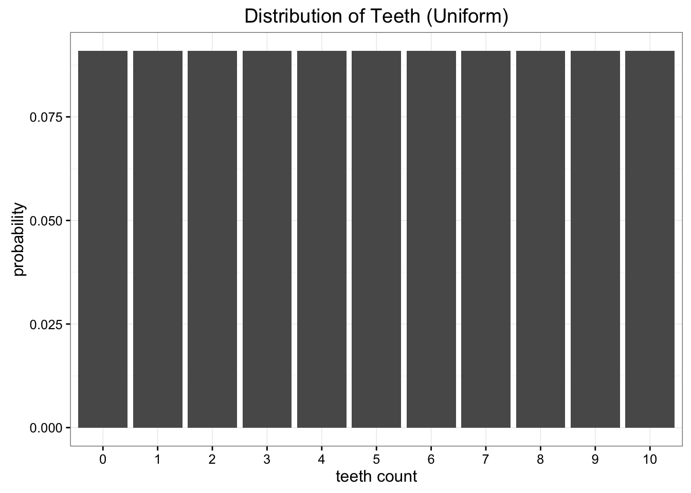
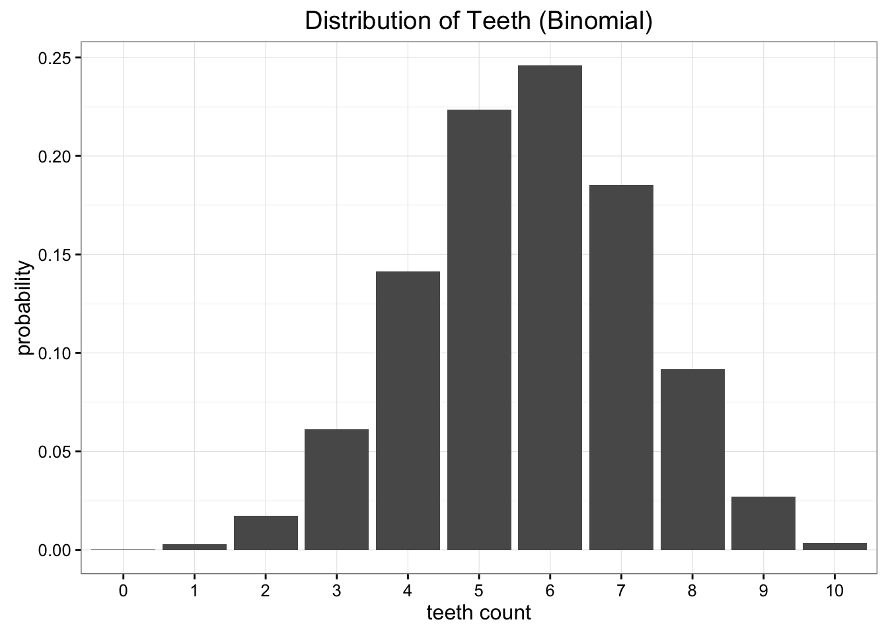
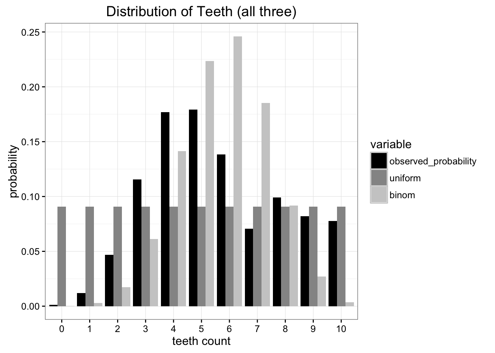

# Notes from Count Bayesie, Probably a Probability Blog: Kullback-Leibler Divergence Explained <https://www.countbayesie.com/blog/2017/5/9/kullback-leibler-divergence-explained>

Very often in Probability and Statistics we'll replace observed data or a complex distributions with a simpler, approximating distribution. **KL Divergence helps us to measure just how much information we lose when we choose an approximation.**

After collecting many samples we have come to this empirical probability distribution of the number of teeth in each worm

Now suppose we want to send this data back, but sending all of it is expensive. We want to reduce this data to a simple model with lesser parameters.

**Option 1**
Uniform distribution

**Option 2**
Binomial Distribution

In this case all we need to do is estimate that probability parameter of the Binomial distribution. We know that if we have $n$ trials and a probability is $p$ then the expectation is just $E [ x] =  n p$.  In this case n = 10, and lets say mean is 5.7 i.e. $p=5.7$ then binomial looks like

Comparing each of our models with our original data we can see that neither one is the perfect match, but which one is better?

**The best test of which is better is to ask which distribution preserves the most information from our original data source. This is where Kullback-Leibler Divergence comes in.**

## Entropy

KL Divergence has its origins in information theory. The primary goal of information theory is to **quantify how much information is in data**. The most important metric in information theory is called Entropy

$$ H = - \sum_{i=1}^{N} p(x_i) \cdot \log p(x_i)$$

**If we use $\log ​2$ for our calculation we can interpret entropy as "the minimum number of bits it would take us to encode our information".**

In this case, the information would be each observation of teeth counts given our empirical distribution. Given the data that we have observed, our probability distribution has an entropy of 3.12 bits. **The number of bits tells us the lower bound for how many bits we would need, on average, to encode the number of teeth we would observe in a single case.**

> Entopy does not tell us the optimal encoding scheme, only the optimal number of bits needed to encode the data.

**Simply knowing the theoretical lower bound on the number of bits we need, we have a way to quantify exactly how much information is in our data.** Now that we can quantify this, *we want to quantify how much information is lost* when we substitute our observed distribution for a parameterized approximation.

## Measuring information lost using KL Divergence

> Similar formula as entropy.

$$ D_{​KL} (p∣∣q)= ∑_{​i=1}^{N} p(x_i​​) \cdot (\log p(x_i) − \log q(x_i )) $$

Essentially, it is the **expectation of the log difference** between the probability of data in the original distribution with the approximating distribution. Again, if we think in terms of $\log​2$ we can interpret this as ***how many bits of information we expect to lose***. We could rewrite our formula in terms of expectation:

$$ D_{​KL} (p∣∣q) = E_p [\log p(x) − \log q(x)] $$

The more common way of writing this is:

$$ D_{​KL} (p∣∣q) = \sum_{i=1}^{N} p(x_i) \cdot \log \frac{p(x_i)}{q(x_i)}  $$

> With KL divergence we can calculate exactly how much information is lost when we approximate one distribution with another.

## Comparing our approximating distributions

Now we calculate the KL divergence for our two approximating distributions. $D_{​KL} (\textrm{Observed} ∣∣ \textrm{Uniform}) = 0.338 $ and $D_{​KL} (\textrm{Observed} ∣∣ \textrm{Binomial}) = 0.477 $, meaning more information was lost by approximating our data with a binomial distribution than with a uniform distribution.

> This is **Divergence not distance**. It's not symmetric so you cannot swap the order of your distributions without changing the result.

## Optimising using KL Divergence

**We can use KL Divergence as an objective function** to find the optimal value for any approximating distribution we can come up with. This is especially useful when extending this approach to high dimensional models with many parameters.

 KL divergence to minimize how much information loss we have when approximating a distribution
