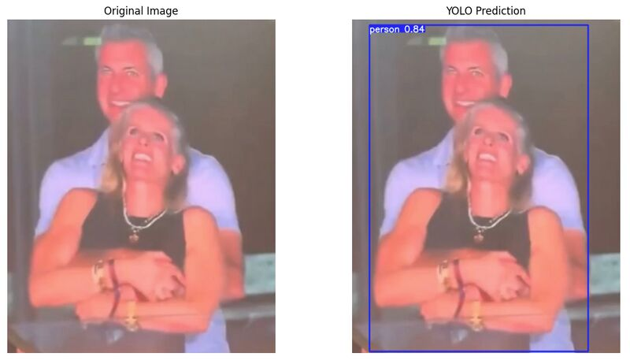
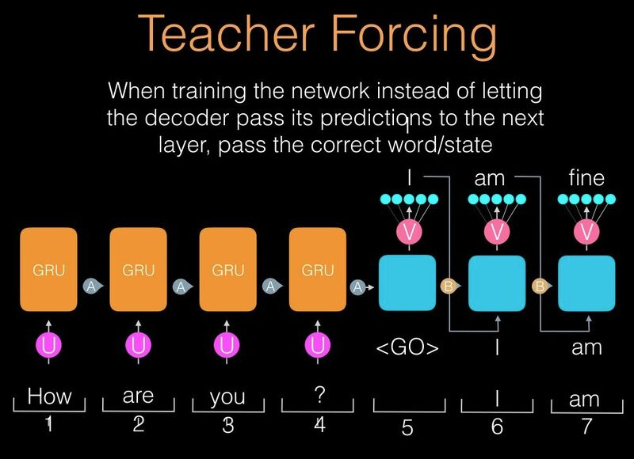

# Notes

> Notes taken from LN Pandey's amazing resources on LinkedIn via FODO AI. Link [here](https://www.linkedin.com/in/lnpandey/recent-activity/all/)

## Chain-of-Thought Is Not Explainability

- CoT explanations are frequently unfaithful, diverging from the true hidden computations that drive model predictions
- Yet ~25% treat it as an interpretability method
- Can mast biases and errors

**Recommendations**

- Stop treating CoT as sufficient for interpretability without verification.
- Use rigorous faithfulness-assessment techniques (e.g., **activation patching, counterfactual interventions, verifier** models).
- Develop causal validation methods (how?)

> CoT often presents plausible stories rather than transparent insight into how models actually think

## Hidden State collapse

**Q:**  
You are analyzing an LLM’s intermediate layers using a Logit Lens to examine logits at different layers and understand how the model constructs its output. You observe that:
a. Early layers produce diverse token predictions resembling parts of the final output.
b. Mid-to-late layers overfit to high-probability tokens, reducing diversity.
c. Final layers collapse into a few dominant token predictions, ignoring earlier diversity.
This worsens when fine-tuning on a small dataset. What is happening, and how can you fix it?

**ANS**  

1. What is happening?
[1a]. Early-layer diversity: Initial layers generate varied token predictions.
[1b]. Mid-to-late layer overfitting: Later layers overfit to high-probability tokens, reducing diversity.
[1c]. Final-layer collapse: The model converges on dominant tokens, ignoring earlier diversity.
[1d]. Fine-tuning exacerbation: Small datasets amplify overfitting, leading to biased outputs.

2. Why does this happen?
[2a]. **Overconfidence in logits**: Deeper layers suppress low-probability tokens.
[2b]. **Low-rank representations**: Hidden state compression reduces information richness.
[2c]. **Fine-tuning effects**: Small datasets cause overfitting to frequent patterns.

3. How to Fix It?
[3a]. **Layer-Wise Learning Rate Scaling** - Use lower learning rates for deeper layers.
[3b]. **Low-Rank Adaptation (LoRA)** - Update selective weights to reduce overfitting.
[3c]. **Introduce Stochasticity - Use dropout**, Mixture of Experts (MoE), or soft attention scaling.
[3d]. **Logit Normalization** - Normalize logits before applying softmax.
[3e]. **Noisy Regularization** - Add Gaussian noise to deep-layer hidden states.

4. A few tips:
[4a]. Plot logit distributions across layers to visualize diversity.
[4b]. Compare attention heatmaps for narrowing focus patterns.
[4c]. Use temperature scaling or logit normalization to prevent overconfidence.
[4d]. Fine-tune selectively with LoRA or adapter layers.

## Why ResNET

- Skip (residual) connections
- Vanishing gradient problem
- Enables training of very deep networks (e.g., 152 layers in ResNet)
- Makes optimization easier and convergence faster

> Impact: ResNet won the ImageNet 2015 competition and is a backbone for many modern architectures like Mask R-CNN, DETR, etc.

## Why even-sized kernels in POOLING

- Efficient downsampling (directly reduces spatial resolution by half)
- No central pixel needed i.e. symmetric isn't cruicial
- Simpler architecture design - modern nets are already even-sized

## Why odd-sized kernels in CONVOLUTION

- Center pixel - symmetric pixel around pixel of interest. Even kernels have no central pixel so convolution becomes ambiguous
- Mathematical convenience: Padding and stride operations become more straightforward with odd-sized filters

## Hard vs Soft labels during DISTILLATION

- Hard labels - one-hot encoded ground truth
- Soft labels - prob distributions
  - Captures inter-class similarities
  - Captures uncertainities which help during generalisation
  - Higher temperatures soften the teachers probability distribution - recommended here?
- Use combinatino of both

$$
\text{Loss} = α * CE(\text{student}, \text{hard label}) + β* KL(\text{student}, \text{teacher soft output})
$$

> Co-distillation: If single strong teacher is unavailable, co-distillation allows multiple models learn from each other simultaneously by *sharing soft predictions*. Encourages diversity and robustness. Often used in distributed training scenarios!

## Yolo LMAO

**QQ** Why Yolo detected only one person

**ANS**  

- Little visual gap between two bodies
- Heavy overlap of limbs
- Partical occlusion - not enough cues to anchor a second box
- **Bounding Box Bias:** YOLO uses anchor boxes and grids. If two people fall in the same grid, it may treat them as a single instance
- Training data limitation
- Lighting and blur: Concert lighting and motion blue worsen clarity and hence model confidence

## CNN for NLP

Yes possible (detecting local patterns)

- Local features (n-grams) **from embeddings**
- Global features: since multiple layers stacked then overall topic/sentiment
- Max/mean pooling: reduces dimensionality while (hopfully) preserving important features
- Pass output to linear layer then classify

## Yolo v1 vs v2

| YOLO v1 | YOLO v2 |
| ---     |  ---    |
| Used a custom CNN | Darknet-19, a deeper and more efficient network |
| Direct coordinate prediction, often inaccurate  |Used anchor boxes for better localization |
| no batch norm | batch norm |
| Struggled due to coarse 7×7 grid | finer feature maps and anchor boxes |
| Limited by dataset (~20 classes) | hierarchical classification to detect 9,000+ classes |

## Teacher forcing

- We train student yes, but at each step, we substitute the model's preds with the ground truths
- So student model sees the best possible data at every step - so training should be better
- Issue **(Exposure Bias)**: While inference, the model has never seen its mistakes earlier - and they may add up

Solutions

- Scheduled sampling: Gradually replace ground truth with model’s own prediction during training
- *Professor forcing!!*: Use adversarial training to align training and inference distributions

## Residual connections over LayerNorm

1. Residuals Alone Aren’t Enough

- Residual connections allow direct paths for backpropagation
- But don't normalize the scale of **activations**
- Over many layers, this can lead to unstable activations, they may explode or drift.

2. What LayerNorm Does ?

- **Normalizes activations across the feature dimension**, $LN(x) = [ (x − μ ) / σ ]⋅γ+β$
- Ensures zero mean and unit variance for **each data point’s features**
- **This stabilizes training by controlling the distribution of inputs to each layer**

3. Why Transformers Need Both ?

- $x_{i+1} = LayerNorm(x_{i} + Sublayer(x_{i} ))$
- Residual: **preserves signal and gradients**.
- LayerNorm: keeps **activations** stable and well-scaled.

**IMPP:** **Without LayerNorm:**

- Models become sensitive to initialization.
- Gradients may still explode or vanish due to layer-wise amplification of unnormalized outputs.

**IMPP:** **Additional Benefit of LayerNorm**

Unlike BatchNorm, LayerNorm works well with:

- **Variable-length sequences**
- **Small batch sizes**
- Autoregressive generation (**no need for batch stats**)

## Dying ReLU (He initialisation)

ReLU - zeros out all negative activations

- In very deep networks, improper initialization can cause activations to vanish (too small → zero gradients) / explode (large → unstable gradients)

> Too many zeros = "dying ReLU" problem

Why He Initialization Works:

Sets weights as:
$ W ∼ N(0, \sqrt{2 / \text{n\_in}})$, where n_in is number of input units in the weight tensor.

> *The factor of 2 helps maintain variance of activations after ReLU*

⏵ Prevents neurons from dying early in training.

**For Xavier Initialisation**

$ W ∼ N(0, \sqrt{2 / \text{n\_in} + \text{n\_out}})$

## Relu Benefits

Gradient saturation (sigmoid problem):
⏵ The **sigmoid function** squashes inputs to the range (0, 1), causing very **small gradients** for large positive or negative inputs.
⏵ This leads to the **vanishing gradient problem**, especially in deep networks, making it hard to train earlier layers.

ReLU activations are non-saturating and sparse:
⏵ ReLU (Rectified Linear Unit) is defined as ReLU(x)=max⁡(0,x)
⏵ It **does not saturate** for positive inputs, gradients remain strong.
⏵ ReLU also **promotes sparsity** by outputting zero for negative inputs, often aiding generalization - may limit richness

## ReLU Issues

- ReLU can lead to dead neurons
- silu or gelu contribute to better optimization
- **Smoothness**: Unlike ReLU, which has a sharp kink at 0, GELU is smooth and differentiable everywhere.
- **Stochastic gating**: GELU softly gates negative inputs rather than hard zeroing them out like ReLU.
- **Better gradient flow**

## Size

LLM interview question - You are running inference using an LLM with 24 layers, Hidden size = 4096, Number of attention heads = 32, Sequence length = 512 tokens, Data type = float16. Estimate the size of the KV cache (in MB) required to store keys and values for a single input during inference ?

Ans -

1. Understand KV cache dimensions:
⏵ Each of the 24 layers stores:

- Key tensor shape = (batch, num_heads, seq_len, head_dim)
- Value tensor shape = (batch, num_heads, seq_len, head_dim)
Where:
head_dim = hidden_size / num_heads = 4096 / 32 = 128
So, each of K and V: (1, 32, 512, 128) so total 2 × this.

2. Calculate size per layer:
⏵ Elements in one K or V: 32 × 512 × 128 = 2,097,152
⏵ Two tensors will be 2 × 2,097,152 = 4,194,304 elements
⏵ Each element = 2 bytes (float16)
⏵ Total bytes per layer = 4,194,304 × 2 = 8,388,608 bytes = 8 MB

3. Multiply by number of layers:
⏵ 8 MB × 24 = 192 MB
⏵ ~192 MB KV cache per input (batch=1)

Therefore in this case, 192MB approx.
