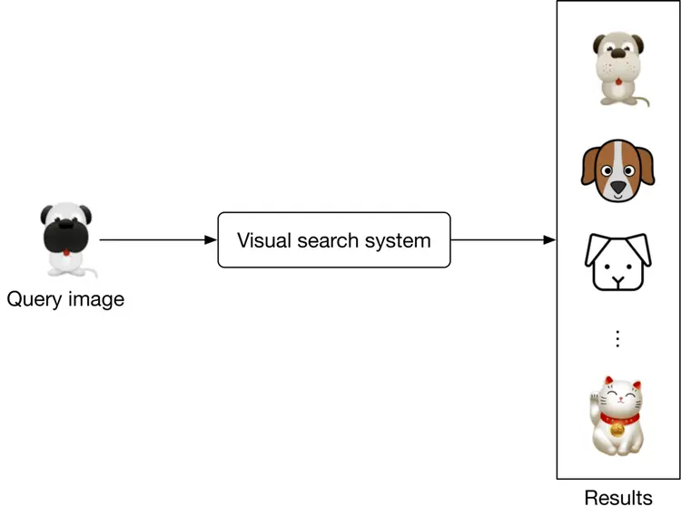
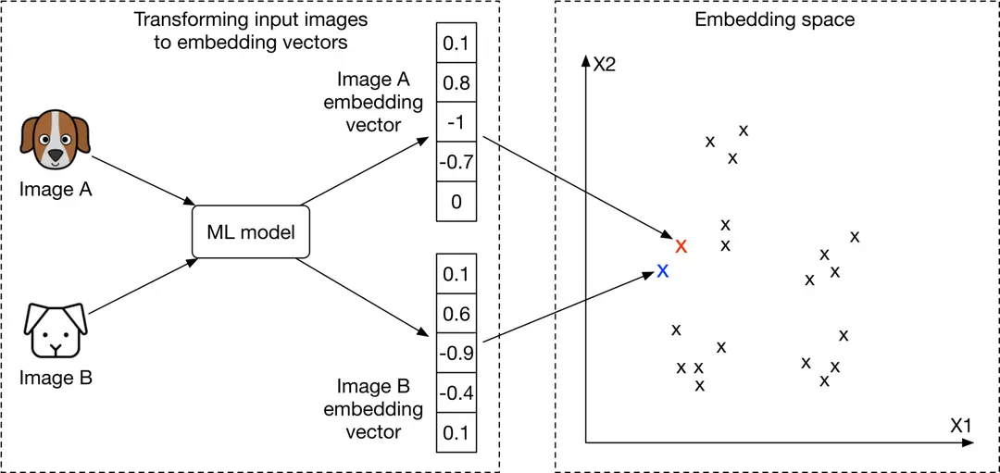
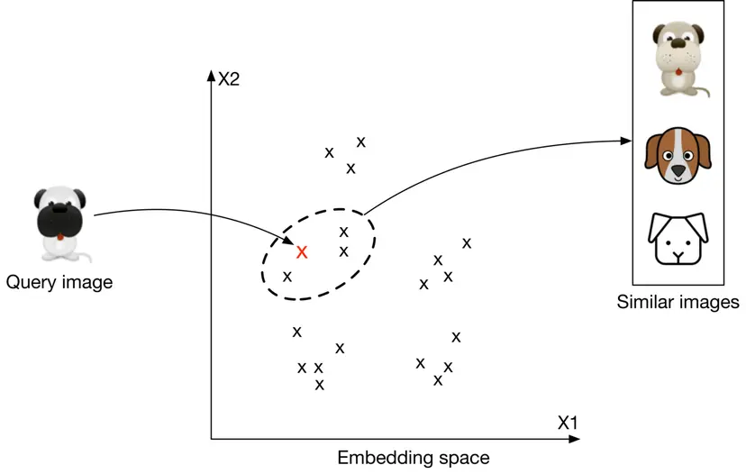
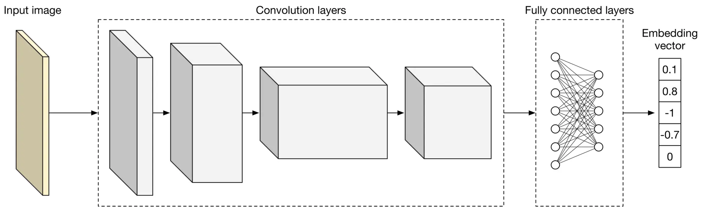
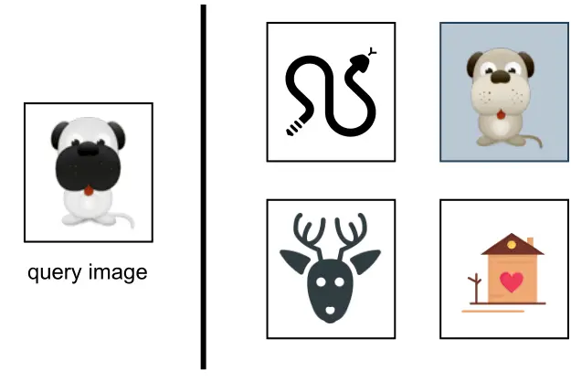

# Visual Search System

A system helps users discover images that are visually similar to a selected image. In this chapter, we design a visual search system similar to Pinterest’s \[1\] \[2\].


Figure 2.1: Retrieved images that are visually similar to the selected crop

### Clarifying Requirements

Here’s a typical interaction between a candidate and an interviewer.

**Candidate**: Should we rank the results from most similar to least similar?

**Interviewer**: Images that appear first in the list should be more similar to the query image.

**Candidate**: Should the system support videos, too?

**Interviewer**: Let’s focus only on images.

**Candidate**: A platform like Pinterest allows users to select an image
crop and retrieve similar images. Should we support that functionality?

**Interviewer**: Yes.

**Candidate**: Are the displayed images personalized to the user?

**Interviewer**: For simplicity, let’s not focus on personalization. A query image yields the same results, regardless of who searches for it.

**Candidate**: Can the model use the metadata of the query image, such as image tags?

**Interviewer**: In practice, the model uses image metadata. But for simplicity, let’s assume we don’t rely on the metadata, but only on the image pixels.

**Candidate**: Can users perform other actions such as save, share, or like? These actions can help label training data.

**Interviewer**: Great point. For simplicity, let’s assume the only supported action is image clicks.

**Candidate**: Should we moderate the images?

**Interviewer**: It’s important to keep the platform safe, but content moderation is out of scope.

**Candidate**: We can construct training data online and label them based on user interactions. Is this the expected way to construct training data?

**Interviewer**: Yes, that sounds reasonable.

**Candidate**: How fast should the search be? Assuming we have 100-200 billion images on the platform, the system should be able to retrieve similar images quickly. Is that a reasonable assumption?

**Interviewer**: Yes, that is a reasonable assumption.

Let’s summarize the problem statement. We are asked to design a visual search system. The system retrieves images similar to the query image provided by the user, ranks them based on their similarities to the query image, and then displays them to the user. The platform only supports images, with no video or text queries allowed. For simplicity, no personalization is required.

### Frame the Problem as an ML Task

In this section, we choose a well-defined ML objective and frame the visual search problem as an ML task.

#### Defining the ML objective

In order to solve this problem using an ML model, we need to create a well-defined ML objective. A potential ML objective is to accurately retrieve images that are visually similar to the image the user is searching for.

#### Specifying the system’s input and output

The input of a visual search system is a query image provided by the user. The system outputs images that are visually similar to the query image, and the output images are ranked by similarities. Figure 2.2 shows the input and output of a visual search system.



Figure 2.2: A visual search system’s input-output

#### Choosing the right ML category

The output of the model is a set of ranked images that are similar to the query image. As a result, visual search systems can be framed as a ranking problem. In general, the goal of ranking problems is to rank a collection of items, such as images, websites, products, etc., based on their relevance to a query, so that more relevant items appear higher in the search results. Many ML applications, such as recommendation systems, search engines, document retrieval, and online advertising, can be framed as ranking problems. In this chapter, we will use a widely-used approach called representation learning. Let’s examine this in more detail.

**Representation learning.** In representation learning \[3\], a model is trained to transform input data, such as images, into representations called embeddings. Another way of describing this is that the model maps input images to points in an N-dimensional space called embedding space. These embeddings are learned so that similar images have embeddings that are in close proximity to each other, in the space. Figure 2.3 illustrates how two similar images are mapped onto two points in close proximity within the embedding space. To demonstrate, we visualize image embeddings (denoted by ‘xxx’) in a 222-dimensional space. In reality, this space is NNN-dimensional, where NNN is the size of the embedding vector.



Figure 2.3: Similar images in the embedding space

###### How to rank images using representation learning?

First, the input images are transformed into embedding vectors. Next, we calculate the similarity scores between the query image and other images on the platform by measuring their distances in the embedding space. The images are ranked by similarity scores, as shown in Figure 2.4.



Figure 2.4: Top 3 images similar to the query image

At this point, you may have many questions, including how to ensure similar images are placed close to each other in the embedding space, how to define the similarity, and how to train such a model. We will talk more about these in the model development section.

### Data Preparation

#### Data engineering

Aside from generic data engineering fundamentals, it’s important to understand what data is available. As a visual search system mainly focuses on users and images, we have the following data available:

- Images
- Users
- User-image interactions

##### Images

Creators upload images, and the system stores the images and their metadata, such as owner id, contextual information (e.g., upload time), tags, etc. Table 2.1 shows a simplified example of image metadata.

| ID | Owner ID | Upload time | Manual tags |
| --- | --- | --- | --- |
| 1 | 8 | 1658451341 | Zebra |
| 2 | 5 | 1658451841 | Pasta, Food, Kitchen |
| 3 | 19 | 1658821820 | Children, Family, Party |

Table 2.1: Image metadata

##### Users

User data contains demographic attributes associated with users, such as age, gender, etc. Table 2.2 shows an example of user data.

| **ID** | **Username** | **Age** | **Gender** | **City** | **Country** | **Email** |
| --- | --- | --- | --- | --- | --- | --- |
| 1 | johnduo | 26 | M | San Jose | USA | [john@gmail.com](mailto:john@gmail.com) |
| 2 | hs2008 | 49 | M | Paris | France | [hsieh@gmail.com](mailto:hsieh@gmail.com) |
| 3 | alexish | 16 | F | Rio | Brazil | [alexh@yahoo.com](mailto:alexh@yahoo.com) |

Table 2.2: User data

##### User-image interactions

Interaction data contains different types of user interactions. Based on the requirements gathered, the primary types of interactions are impressions and clicks. Table 2.3 shows an overview of interaction data.

| User ID | Query image ID | Displayed image ID | Position in the displayed list | Interaction type | Location (lat, long) | Timestamp |
| --- | --- | --- | --- | --- | --- | --- |
| 8 | 2 | 6 | 1 | Click | 38.8951 -77.0364 | 1658450539 |
| 6 | 3 | 9 | 2 | Click | 38.8951 -77.0364 | 1658451341 |
| 91 | 5 | 1 | 2 | Impression | 41.9241 -89.0389 | 1658451365 |

Table 2.3: User-image interaction data

#### Feature engineering

In this section, you are expected to talk about engineering great features and preparing them as model inputs. This usually depends on how we framed the task and what the model’s inputs are. In the earlier “Framing the problem as an ML task” section, we framed the visual search system as a ranking problem and used representation learning to solve it. In particular, we employed a model which expects an image as input. The image needs to be preprocessed before being passed to the model. Let’s take a look at common image preprocessing operations:

- **Resizing:** Models usually require fixed image sizes (e.g., 224×224224 \\times 224224×224)
- **Scaling:** Scale pixel values of the image to the range of 000 and 111
- **Z-score normalization:** Scale pixel values to have a mean of 000
and variance of 111
- **Consistent :** Ensuring images have a consistent color mode (e.g.,
RGB or CMYK)

### Model Development

#### Model selection

We choose neural networks because:

- Neural networks are good at handling unstructured data, such as images and text
- Unlike many traditional machine learning models, neural networks are able to produce the embeddings we need for representation learning

What types of neural network architectures should we use? It is essential that the architecture works with images. CNN-based architectures such as ResNet \[4\] or more recent Transformer-based architectures \[5\] such as ViT \[6\] perform well with image inputs. Figure 2.5 shows a simplified model architecture that transforms the input image into an embedding vector. The number of convolution layers, the number of neurons in fullyconnected layers, and the size of the embedding vector are hyperparameters typically chosen via experimentation.



Figure 2.5: A simplified model architecture

#### Model training

In order to retrieve visually similar images, a model must learn representations (embeddings) during training. In this section, we discuss how to train a model to learn image representations.

A common technique for learning image representations is contrastive training \[7\]. With this technique, we train the model to distinguish similar and dissimilar images. As Figure 2.6 shows, we provide the model with a query image (left), one similar image to the query image (highlighted dog image on the right), and a few dissimilar images (also right.) During training, the model learns to produce representations in which the similar image more closely resembles the query image, than do other images on the right side of Figure 2.6.



Figure 2.6: Contrastive training

To train the model using the contrastive training technique, we first need to construct training data.

#### Constructing the dataset

As described earlier, each data point used for training contains a query image, a positive image that’s similar to the query image, and n−1{n-1}n−1 negative images that are dissimilar to the query image. The ground truth label of the data point is the index of the positive image. As Figure 2.7 shows, along with the query image (q), we have nnn other images, of which one is similar to the q (image of the dog), and the other n−1{n-1}n−1 images are dissimilar. The ground truth label for this data point is the index of the positive image, which is 222 (the second image among the nnn images in Figure 2.7.

![Image represents a data sample for a machine learning model, likely designed for image classification or similarity tasks.  On the left, a cartoon image labeled 'Image q' depicts a dog's head; this serves as the query image.  To its right, a dashed-line box contains a set of images: a house, another cartoon dog (similar to the query image), an ellipsis indicating more images, and a snake (dissimilar images). The text above this box specifies 'One image similar to q and n-1 dissimilar images,' clarifying the composition of the image set.  A dashed-line box on the far right contains the number '2,' representing the label associated with the input image set. A long horizontal arrow labeled 'Input' connects the query image and the image set, indicating that the entire collection is fed as input to the model. Another arrow labeled '-label-' connects the input set to the label '2,' suggesting that the label represents a class or category to which the input image set belongs.  The overall structure illustrates a typical input-output relationship in a machine learning model, where a set of images (including a query image and its similar/dissimilar counterparts) is used to predict a label.](https://bytebytego.com/_next/image?url=%2Fimages%2Fcourses%2Fmachine-learning-system-design-interview%2Fvisual-search-system%2Fch2-07-GBPQAS67.png&w=3840&q=75)

Figure 2.7: Training data point

To construct a training data point, we randomly choose a query image and n−1{n-1}n−1 images as negative images. To select a positive image, we have the following three options:

- Use human judgment
- Use interactions such as user clicks as a proxy for similarity
- Artificially create a similar image from the query image, known as self-supervision

Let’s evaluate each option.

###### Use human judgments

This approach relies on human contractors manually finding similar images. Human involvement produces accurate training data, but using human annotators is expensive and time-consuming.

###### Use interactions such as user click as a proxy for similarity

In this approach, we measure similarity based on interaction data. As an example, when a user clicks on an image, the clicked image is considered to be similar to the query image q.

This approach does not require manual work and can generate training data automatically. However, the click signal is usually very noisy. Users sometimes click on images even when the image is not similar to the query image. Additionally, this data is very sparse, and we may not have click data available for lots of the images. The use of noisy and sparse training data leads to poor performance.

###### Artificially create a similar image from the query image

In this approach, we artificially create a similar image from the query image. For example, we can augment the query image by rotating it and using the newly generated image as a similar image. Recently developed frameworks such as SimCLR \[7\] and MoCo \[8\] use the same approach.

![Image represents a data augmentation process for machine learning.  A single image, labeled 'Image q,' depicting a cartoon dog's head, is shown on the left.  A curved arrow labeled 'Augmented image' connects this image to a dashed-line rectangular box containing an augmented dataset. This box contains a total of 'n' images; one image similar to the original dog image (another cartoon dog's head), and 'n-1' dissimilar images.  One of the dissimilar images is a cartoon house with a heart on it, and another is a cartoon snake.  An ellipsis (...) indicates the presence of additional dissimilar images within the box, implying a variable number (n-2) of other images not explicitly shown. The arrangement visually demonstrates the creation of a training dataset where the original image 'q' is augmented with similar and dissimilar examples to improve the model's robustness and generalization capabilities.](https://bytebytego.com/_next/image?url=%2Fimages%2Fcourses%2Fmachine-learning-system-design-interview%2Fvisual-search-system%2Fch2-08-XZ5Y5CAV.png&w=3840&q=75)

Figure 2.8: Use data augmentation to create a similar image

An advantage of this method is that no manual work is required. We can implement simple data augmentation logic to create similar images. In addition, the constructed training data is not noisy, since augmenting an image always results in a similar image. The major drawback of this approach is that the constructed training data differs from the real data. In practice, similar images are not augmented versions of the query image; they are visually and semantically similar, but are distinct.

###### Which approach works best in our case?

In an interview setting, it’s critical you propose various options and discuss their tradeoffs. There is usually not a single best solution that always works. Here, we use the self-supervision option for two reasons. Firstly, there is no upfront cost associated with it, since the process can be automated. Secondly, various frameworks such as SimCLR \[7\] have shown promising results when trained on a large dataset. Since we have access to billions of images on the platform, this approach might be a good fit.

We can always switch to other labeling methods if the experiment results are unsatisfactory. For example, we can start with the self-supervision option and later use click data for labeling. We can also combine the options. For example, we may use clicks to build our initial training data and rely on human annotators to identify and remove noisy data points. Discussing different options and trade-offs with the interviewer is critical to make good design decisions.

Once we construct the dataset, it’s time to train the model using a proper loss function.

#### Choosing the loss function

As Figure 2.9 shows, the model takes images as input and produces an embedding for each input image. Ex{E\_x}Ex​ denotes the embedding of the image xxx.

![Image represents a machine learning model training and inference pipeline for image similarity.  A query image, labeled 'q', is input along with a set of images: one positive image ('p') and 'i' negative images (N₁, N₂, ..., Nᵢ).  These images are fed into an 'ML model', which processes them.  The model's output consists of embedding vectors: E<sub>q</sub> (embedding for the query image), E<sub>p</sub> (embedding for the positive image), and E₁, E₂, ..., Eᵢ (embeddings for the negative images).  The dashed lines indicate that the positive and negative images are used for training the model, while the solid lines show the flow of data during inference.  The 'ML model' learns to generate embeddings such that similar images have closer embedding vectors in the embedding space.](https://bytebytego.com/_next/image?url=%2Fimages%2Fcourses%2Fmachine-learning-system-design-interview%2Fvisual-search-system%2Fch2-09-L6IJ5CUB.png&w=3840&q=75)

Figure 2.9: Model input-output

The goal of the training is to optimize the model parameters so that similar images have embeddings close to each other in the embedding space. As Figure 2.10 shows, the positive image and the query image should become closer during training.

![Image represents a graph illustrating a nearest neighbor search algorithm.  The graph is plotted on a two-dimensional plane with axes labeled x1 and x2.  A central node labeled 'q' represents the query point. Three nodes labeled 'n' represent data points in the feature space. One node labeled 'p' represents another data point.  Solid arrows indicate a direct connection from 'p' to 'q', suggesting 'p' is a relatively close neighbor to 'q'. Dashed arrows connect 'q' to the three 'n' nodes, indicating these are also neighbors of 'q', but potentially farther away than 'p'. The relative distances are further clarified by a legend in a box to the upper right. This legend shows a solid arrow labeled 'Close' and a dashed arrow labeled 'Far,' visually representing the different connection types and their implied distances. The overall diagram shows how a query point ('q') finds its nearest neighbors ('p' and the three 'n' nodes) within the feature space defined by x1 and x2.](https://bytebytego.com/_next/image?url=%2Fimages%2Fcourses%2Fmachine-learning-system-design-interview%2Fvisual-search-system%2Fch2-10-XNYBLLRY.png&w=3840&q=75)

Figure 2.10: Input images mapped into the embedding space

To achieve this goal, we need to use a loss function to measure the quality of the produced embeddings. Different loss functions are designed for contrastive training, and interviewers don’t usually expect you to hold an in-depth discussion. However, it is crucial to have a high-level understanding of how contrastive loss functions work.

We are going to briefly discuss how a simplified contrastive loss operates. If you are interested in learning more about contrastive losses, refer to \[9\].

![Image represents a diagram illustrating a machine learning model's architecture and loss calculation.  On the left, a dashed-line box contains vertical stacked boxes labeled  `E<sub>q</sub>`, `E<sub>p</sub>`, `E<sub>1</sub>`, `E<sub>2</sub>`, and `E<sub>i</sub>`, representing embedding vectors.  These vectors are fed into a 'compute similarities' block, resulting in a dashed-line box containing  `E<sub>q</sub> · E<sub>p</sub>`, `E<sub>q</sub> · E<sub>1</sub>`, `E<sub>q</sub> · E<sub>2</sub>`, and `E<sub>q</sub> · E<sub>i</sub>`, representing dot products between the query embedding `E<sub>q</sub>` and other embeddings.  These dot products are then passed through a 'Softmax' function, producing a dashed-line box with probability values: `0.95`, `0.02`, `0.01`, and `0.003`.  These probabilities are compared to a 'Label' vector (another dashed-line box) containing `1`, `0`, `0`, and `0` using 'cross entropy' as the loss function. The label vector represents the ground truth, indicating the correct class for the query.  The entire process shows how the model computes similarities between embeddings, normalizes them using softmax to obtain probabilities, and then calculates the cross-entropy loss to measure the difference between predicted probabilities and the true labels.](https://bytebytego.com/_next/image?url=%2Fimages%2Fcourses%2Fmachine-learning-system-design-interview%2Fvisual-search-system%2Fch2-11-5OW5575U.png&w=3840&q=75)

Figure 2.11: A simplified contrastive loss

As Figure 2.11 shows, we compute the contrastive loss in three steps.

**Compute similarities.** First, we compute the similarities between the query image and the embeddings of other images. Dot product \[10\] and cosine similarity \[11\] are widely used to measure the similarity between points in the embedding space. Euclidean distance \[12\] can also measure the similarity. However, Euclidean distance usually performs poorly in high dimensions because of the curse of dimensionality \[13\]. To learn more about the curse of dimensionality issues, read \[14\].

**Softmax.** A softmax function is applied over the computed distances. This ensures the values sum up to one, which allows the values to be interpreted as probabilities.

**Cross-entropy.** Cross-entropy \[15\] measures how close the predicted probabilities are to the ground truth labels. When the predicted probabilities are close to the ground truth, it shows that the embeddings are good enough to distinguish the positive image from the negative ones.

In the interview, you can also discuss the possibility of using a pre-trained model. For example, we could leverage a pre-trained contrastive model and fine-tune it using the training data. These pre-trained models have already been trained on large datasets, and therefore they have learned good image representations. This significantly reduces the training time compared to training a model from scratch.

### Evaluation

After we develop the model, we can discuss the evaluation. In this section, we cover important metrics for offline and online evaluations.

#### Offline metrics

Based on the given requirements, an evaluation dataset is available for offline evaluation. Let’s assume each data point has a query image, a few candidate images, and a similarity score for each candidate image and the query image pair. A similarity score is an integer number between 000 to 555, where 000 indicates no similarity and 555 indicates two images are visually and semantically very similar. For each data point in the evaluation dataset, we compare the ranking produced by the model with the ideal ranking, based on the ground truth scores.

![Image represents a query image of a cartoon beagle's head, positioned to the left, followed by five other images: a pug, a simple black silhouette of a dog on a leash, a deer's head, a house with a heart on it, and a Maneki-neko (lucky cat). Each of these five images is associated with a numerical 'ground truth similarity score' displayed below it: 5, 4, 1, 0, and 2, respectively.  These scores represent a measure of visual similarity between the query image (the beagle) and each of the other images, with higher scores indicating greater similarity.  A curved line connects the scores, visually grouping them as a set of ground truth similarity scores related to the query image.  The arrangement suggests an evaluation process where the algorithm's assessment of image similarity is compared against these pre-defined ground truth scores.](https://bytebytego.com/_next/image?url=%2Fimages%2Fcourses%2Fmachine-learning-system-design-interview%2Fvisual-search-system%2Fch2-12-7N3XKKII.png&w=3840&q=75)

Figure 2.12: A data point from the evaluation dataset

Now, let’s examine offline metrics that are commonly used in search systems. Note that search, information retrieval, and recommendation systems usually share the same offline metrics.

- Mean reciprocal rank (MRR)
- Recall@k
- Precision@k
- Mean average precision (mAP)
- Normalized discounted cumulative gain (nDCG)

**MRR.** This metric measures the quality of the model by considering the rank of the first relevant item in each output list produced by the model, and then averaging them. The formula is:

MRR=1m∑i=1m1rankiMRR= \\frac{1}{m} \\sum\_{i=1}^m \\frac{1}{rank\_i}MRR=m1​i=1∑m​ranki​1​

Where mmm is the total number of output lists and rankirank\_iranki​ refers to the rank of the first relevant item in the _i_ th output list.

Figure 2.13 illustrates how this works. For each of the 4 ranked lists, we compute the reciprocal rank (RR) and then calculate the average value of the RRs to get the MRR.

![Image represents a calculation of Mean Reciprocal Rank (MRR).  At the top, a checkbox indicates 'Relevant item' (checked) and 'Non-relevant item' (unchecked). Below, four 'Ranked lists' (1-4) are shown, each containing four empty boxes representing ranked items. Checkmarks (✓) within the boxes denote relevant items' positions in each list.  To the right of each ranked list is a 'Reciprocal rank' value; this is the reciprocal of the rank of the first relevant item in that list (e.g., 1/3 if the first relevant item is ranked third).  If no relevant item is present, the reciprocal rank is 0. Finally, at the bottom, 'Mean reciprocal rank' is calculated by averaging the reciprocal ranks of all four lists, resulting in a value of 0.417 in this example.  The calculation (1/3 + 1 + 1/3 + 0)/4 = 0.417 is explicitly shown.](https://bytebytego.com/_next/image?url=%2Fimages%2Fcourses%2Fmachine-learning-system-design-interview%2Fvisual-search-system%2Fch2-13-U7VWCIVI.png&w=3840&q=75)

Figure 2.13: MRR calculation example

Let’s examine the shortcoming of this metric. Since MRR considers only the first relevant item and ignores other relevant items in the list, it does not measure the precision and ranking quality of a ranked list. For example, Figure 2.14 shows the outputs of two different models. The output of model 1 has 3 relevant items, while the output of model 2 has 1 relevant item. However, the reciprocal rank of both models is 0 5. Given this shortcoming, we will not use this metric.

![Image represents a comparison of the outputs of two models, Model 1 and Model 2, evaluated using Mean Reciprocal Rank (MRR).  Each model's output is shown as a sequence of five boxes; a checkmark (✓) indicates a correct prediction, while an empty box represents an incorrect prediction. Model 1's output shows three consecutive correct predictions followed by two incorrect ones, while Model 2's output shows one correct prediction followed by four incorrect ones.  To the right of each model's output is a box labeled 'MRR' containing the value '1/2'. This indicates that both models achieved a Mean Reciprocal Rank of 0.5, suggesting that the first correct prediction for each model was found at rank 2.  There are no explicit connections drawn between the model outputs and their respective MRR values, but the juxtaposition implies a direct relationship where the MRR is calculated based on the position of the first correct prediction in each model's output sequence.](https://bytebytego.com/_next/image?url=%2Fimages%2Fcourses%2Fmachine-learning-system-design-interview%2Fvisual-search-system%2Fch2-14-72IN7TUD.png&w=3840&q=75)

Figure 2.14: MRR of two different models

**Recall@k.** This metric measures the ratio between the number of
relevant items in the output list and the total number of relevant items
available in the entire dataset. The formula is:

recall@k= number of relevant items among the top k items in the output list  total relevant items \\text {recall@k} =\\frac{\\text { number of relevant items among the top } k \\text { items in the output list }}{\\text { total relevant items }}recall@k= total relevant items  number of relevant items among the top k items in the output list ​

Even though recall@k measures how many relevant items the model failed to include in the output list, this isn’t always a good metric. Let’s understand why not. In some systems, such as search engines, the total number of relevant items can be very high. This negatively affects the recall as the denominator is very large. For example, when the query image is an image of a dog, the database may contain millions of dog images. The goal is not to return every dog image but to retrieve a handful of the most similar dog images.

Given recall@k doesn’t measure the ranking quality of the model, we will not use it.

**Precision@k.** This metric measures the proportion of relevant items among the top k items in the output list. The formula is:

precision@k = number of relevant items among the top k items in the output list k\\text { precision@k } =\\frac{\\text { number of relevant items among the top } {k} \\text { items in the output list }}{{k}} precision@k =k number of relevant items among the top k items in the output list ​

This metric measures how precise the output lists are, but it doesn’t consider the ranking quality. For example, in Figure 2.15, if we rank more relevant items higher in the list, the precision won’t change. This metric is not ideal for our use case, since we need to measure both the precision and ranking quality of the results.

![Image represents the outputs of two different models, Model 1 and Model 2, evaluated using Precision@5.  Each model's output is shown as a row of five boxes; a checkmark (✓) indicates a correct prediction, while an empty box represents an incorrect prediction. Model 1's output shows two correct predictions in the first two boxes, followed by three incorrect predictions. Model 2's output shows two correct predictions, one in the third and one in the fifth box, with three incorrect predictions.  To the right of each model's output, a box displays the Precision@5 score, calculated as the number of correct predictions (2) divided by the total number of predictions (5), resulting in a score of 2/5 for both models.  The image visually demonstrates the performance comparison of two models using a common ranking metric in information retrieval and machine learning.](https://bytebytego.com/_next/image?url=%2Fimages%2Fcourses%2Fmachine-learning-system-design-interview%2Fvisual-search-system%2Fch2-15-J3OPLXRL.png&w=3840&q=75)

Figure 2.15: Precision@5 of two different models

**mAP.** This metric first computes the average precision (AP) for each output list, and then averages AP values.

Let’s first understand what AP is. It takes a list of kkk items, such as images, and averages the precision@k at different values of kkk. AP is high if more relevant items are located at the top of the list. For a list of size kkk, the AP formula is:

AP=∑i=1k Precision@i if i’th item is relevant to the user  total relevant items AP= \\frac{\\sum\_{i=1}^k \\text { Precision@$i$ if i'th item is relevant to the user }}{\\text { total relevant items }}


AP= total relevant items ∑i=1k​ Precision@i if i’th item is relevant to the user ​

Let’s look at an example to better understand the metric. Figure 2.16 shows AP calculations for each of the 4 output lists produced by the model.

![Image represents a calculation of Mean Average Precision (MAP) across four ranked lists.  The top shows a legend indicating checkmarks represent relevant items and empty boxes represent non-relevant items.  Each of the four subsequent sections depicts a ranked list (1-4) with checkmarks indicating the positions of relevant items.  Above each relevant item in a list is a fraction (e.g., P=1/3, P=2/4) representing the precision at that point (number of relevant items retrieved up to that point divided by the total number of items retrieved up to that point).  For each ranked list, an 'Average Precision' is calculated by summing the precision values at each relevant item and dividing by the total number of relevant items in that list.  These individual Average Precision values (0.33, 0.75, 0.41, and 0) are then summed and divided by the total number of lists (4) to obtain the final Mean Average Precision of 0.37.  The diagram visually demonstrates the step-by-step process of calculating MAP from individual ranked lists.](https://bytebytego.com/_next/image?url=%2Fimages%2Fcourses%2Fmachine-learning-system-design-interview%2Fvisual-search-system%2Fch2-16-L6MB3AV6.png&w=3840&q=75)

Figure 2.16: mAP calculations

Since we average precisions, the overall ranking quality of the list is considered. However, mAP is designed for binary relevances; in other words, it works well when each item is either relevant or irrelevant. For continuous relevance scores, nDCG is a better choice.

**nDCG.** This metric measures the ranking quality of an output list and shows how good the ranking is, compared to the ideal ranking. First, let’s explain DCG and then discuss nDCG.

###### What is DCG?

DCG calculates the cumulative gain of items in a list by summing up the relevance score of each item. Then the score is accumulated from the top of the output list to the bottom, with the score of each result discounted at lower ranks. The formula is:

$$
DCGp=∑i=1prelilog⁡2(i+1)\\mathrm{DCG\_p}=\\sum\_{i=1}^p \\frac{r e l\_i}{\\log \_2(i+1)}DCGp​=i=1∑p​log2​(i+1)reli​​
$$

Where relirel\_ireli​ is the ground truth relevance score of the image ranked at location iii.

###### What is nDCG?

Because DCG sums up the relevance scores of items and discounts their positions, the result of DCG could be any value. In order to get a more meaningful score, we need to normalize DCG. For this, nDCG divides the DCG by the DCG of an ideal ranking. The formula is:

$$
nDCGp=DCGpIDCGp\\mathrm {nDCG\_p}=\\frac{DCG\_p}{IDCG\_p}nDCGp​=IDCGp​DCGp​​
$$

Where IDCGp{IDCG\_p}IDCGp​ is the DCGDCGDCG of the ideal ranking (a ranking ordered by the relevance scores of items). Note that in a perfect ranking system, the DCG is equal to IDCG.

Let’s use an example to better understand nDCG. In Figure 2.17, we can see a list of output images and their associated ground truth relevance scores produced by a search system.

![Image represents a comparison between ground truth relevance scores and a ranked list produced by a machine learning (ML) model.  Five images—a house with a heart, a pug, a deer head, a dog on a leash, and a Maneki-neko (lucky cat)—are each assigned a ground truth relevance score (0, 5, 1, 4, and 2 respectively), indicated by numbers placed to the right of each image.  A rightward arrow connects the text 'Ground truth relevance scores' to the first image and its score, illustrating the input of true relevance values.  These images and their associated scores are then presented again, but this time arranged according to the ranking produced by the ML model, indicated by a curved line underneath and labeled 'Ranked list produced by ML'.  The arrangement shows the ML model's output ranking differs from the ground truth relevance scores, implying a potential discrepancy in the model's performance.](https://bytebytego.com/_next/image?url=%2Fimages%2Fcourses%2Fmachine-learning-system-design-interview%2Fvisual-search-system%2Fch2-17-74M5WIIG.png&w=3840&q=75)

Figure 2.17: A ranked list produced by a search system

We can compute nDCG in 3 steps:

1. Compute DCG
2. Compute IDCG
3. Divide DCG by IDCG

**Compute DCG:** The DCG for the current ranking produced by the model is:

DCGp=∑i=1prelilog⁡2(i+1)=0log⁡2(2)+5log⁡2(3)+1log⁡2(4)+4log⁡2(5)+2log⁡2(6)=6.151\\mathrm {DCG\_p}=\\sum\_{i=1}^p \\frac{r e l\_i}{\\log \_2(i+1)}=\\frac{0}{\\log \_2(2)}+\\frac{5}{\\log \_2(3)}+\\frac{1}{\\log \_2(4)}+\\frac{4}{\\log \_2(5)}+\\frac{2}{\\log \_2(6)}=6.151DCGp​=i=1∑p​log2​(i+1)reli​​=log2​(2)0​+log2​(3)5​+log2​(4)1​+log2​(5)4​+log2​(6)2​=6.151

**Compute IDCG:** The ideal ranking calculation is the same as the DCG calculation, except that it recommends the most relevant items first (Figure 2.18).

![Image represents five images of different objects arranged horizontally, each within a square box.  From left to right, the images depict: a cartoon pug dog, a simple black silhouette of a dog on a leash, a Maneki-neko (lucky cat), a deer head, and a cartoon house with a heart on it.  Below each image is a numerical label: 5, 4, 2, 1, and 0 respectively.  A curved line connects the bottom of the numerical labels, with the text 'Ideal ranking' written beneath it, indicating that the numbers represent a ranking of the images, with 5 being the highest ranked and 0 the lowest.  The arrangement visually displays a ranked list of images, likely used to illustrate a concept in machine learning, such as ranking algorithms or preference learning.](https://bytebytego.com/_next/image?url=%2Fimages%2Fcourses%2Fmachine-learning-system-design-interview%2Fvisual-search-system%2Fch2-18-ENGEWEMU.png&w=3840&q=75)

Figure 2.18: Ideal ranking list

The IDCG for the ideal ranking is:

IDCGp=∑i=1νrelilog⁡2(i+1)=5log⁡2(2)+4log⁡2(3)+2log⁡2(4)+1log⁡2(5)+0log⁡2(6)=8.9543\\text {IDCG}\_p=\\sum\_{i=1}^\\nu \\frac{r e l\_i}{\\log \_2(i+1)}=\\frac{5}{\\log \_2(2)}+\\frac{4}{\\log \_2(3)}+\\frac{2}{\\log \_2(4)}+\\frac{1}{\\log \_2(5)}+\\frac{0}{\\log \_2(6)}=8.9543IDCGp​=i=1∑ν​log2​(i+1)reli​​=log2​(2)5​+log2​(3)4​+log2​(4)2​+log2​(5)1​+log2​(6)0​=8.9543

**Divide DCG by IDCG:**

nDCGp=DCGpIDCGp=6.1518.9543=0.6869\\mathrm {nDCG\_p}=\\frac{DCG\_p}{IDCG\_p}=\\frac{6.151}{8.9543}=0.6869nDCGp​=IDCGp​DCGp​​=8.95436.151​=0.6869

nDCG works well most times. Its primary shortcoming is that deriving ground truth relevance scores is not always possible. In our case, since the evaluation dataset contains similarity scores, we can use nDCG to measure the performance of the model during the offline evaluation.

#### Online metrics

In this section, we explore a few commonly used online metrics for measuring how quickly users can discover images they like.

**Click-through rate (CTR).** This metric shows how often users click on the displayed items. CTR can be calculated using the following formula:

CTR= Number of clicked images  Total number of suggested images \\mathrm{CTR}= \\frac{\\text { Number of clicked images }}{\\text { Total number of suggested images }}CTR= Total number of suggested images  Number of clicked images ​

A high CTR indicates that users click on the displayed items often. CTR is commonly used as an online metric in search and recommendation systems, as we will see in later chapters.

**Average daily, weekly, and monthly time spent on the suggested images.** This metric shows how engaged users are with the suggested images. When the search system is accurate, we expect this metric to increase.

### Serving

At serving time, the system returns a ranked list of similar images based on a query image. Figure 2.19 shows the prediction pipeline and an indexing pipeline. Let’s look closer at each pipeline.

![Image represents a system for retrieving similar images.  A stream of new images is ingested into an 'Object storage,' then processed by an 'Indexing service' within the 'Indexing pipeline,' ultimately populating an 'Index table.'  Separately, a 'Query image' is input into the 'Prediction pipeline.' This query image is first preprocessed, then fed into an 'Embedding generation service,' which utilizes a 'Trained ML model' to generate an 'Image embedding.' This embedding is then passed to a 'Nearest neighbor service' which searches the 'Index table' for similar images. The results are further refined by a 'Re-ranking service' before a list of 'Similar images' is outputted.  The entire process involves two main pipelines: an indexing pipeline for creating and maintaining the image database, and a prediction pipeline for retrieving similar images based on a query image.](https://bytebytego.com/_next/image?url=%2Fimages%2Fcourses%2Fmachine-learning-system-design-interview%2Fvisual-search-system%2Fch2-19-7XJ5YHZ6.png&w=3840&q=75)

Figure 2.19: Prediction and indexing pipeline

#### Prediction pipeline

##### Embedding generation service

This service computes the embedding of the input query image. As Figure 2.20 shows, it preprocesses the image and uses the trained model to determine the embedding.

![Image represents a simplified machine learning pipeline for image embedding generation.  A cartoon pug image, labeled 'Query image,' is fed into an 'Embedding generation service.' This service receives two inputs: the query image (after preprocessing) and a 'Trained ML model.' The preprocessing step prepares the query image for processing by the embedding generation service. The trained ML model is a pre-existing component that the service utilizes. The output of the 'Embedding generation service' is a vector 'E' represented as a column vector with four numerical values: 0.1, 0.6, -0.9, and -0.4.  Arrows indicate the flow of data from the query image through preprocessing to the embedding generation service, which then uses the trained ML model to produce the final embedding vector E.](https://bytebytego.com/_next/image?url=%2Fimages%2Fcourses%2Fmachine-learning-system-design-interview%2Fvisual-search-system%2Fch2-20-FSXVEER3.png&w=3840&q=75)

Figure 2.20: Embedding generation service

##### Nearest neighbor service

Once we get the embedding of the query image, we need to retrieve similar images from the embedding space. The nearest neighbor service does this.

Let’s define the nearest neighbor search more formally. Given a query point “q” and a set of other points S, it finds the closest points to “q” in set S. Note that an image embedding is a point in NNN-dimensional space, where NNN is the size of the embedding vector. Figure 2.21 shows the top 3 nearest neighbors of image q. We denote the query image as q, and other images as xxx.

![Image represents a two-dimensional scatter plot illustrating a k-nearest neighbors (k-NN) algorithm.  The horizontal axis is labeled 'X1' and the vertical axis 'X2'. Multiple data points are depicted as 'x' symbols scattered across the plot. A dashed, irregularly shaped oval encloses a cluster of five 'x' points, including one labeled in red as 'q'.  The text 'k=3' is positioned near the oval, indicating that the algorithm considers the three nearest neighbors to classify a point. The arrangement shows that point 'q' and its three nearest neighbors are within the oval, suggesting they belong to the same class or cluster.  The remaining 'x' points outside the oval represent data points belonging to different classes or clusters, illustrating the algorithm's ability to group similar data points based on proximity.](https://bytebytego.com/_next/image?url=%2Fimages%2Fcourses%2Fmachine-learning-system-design-interview%2Fvisual-search-system%2Fch2-21-JWTLFCTR.png&w=3840&q=75)

Figure 2.21: Top 3 nearest neighbors to image q in the embedding space

##### Re-ranking service

This service incorporates business-level logic and policies. For example, it filters inappropriate results, ensures we don’t include private images, removes duplicates or near-duplicate results, and enforces other similar logic before displaying the final results to the user.

#### Indexing pipeline

##### Indexing service

All images on the platform are indexed by this service to improve search performance.

Another responsibility of the indexing service is to keep the index table updated. For example, when a creator adds a new image to the platform, the service indexes the embedding of the new image to make it discoverable by the nearest neighbor search.

Indexing increases memory usage because we store the embeddings of the entire images in an index table. Various optimizations are available to reduce memory usages, such as vector quantization \[16\] and product quantization \[17\].

#### Performance of nearest neighbor (NN) algorithms

Nearest neighbor search is a core component of information retrieval, search, and recommendation systems. A slight improvement in its efficiency leads to significant overall performance improvement. Given how critical this component is, the interviewer may want you to deep dive into this topic.

NN algorithms can be divided into two categories: exact and approximate. Let’s examine each in more detail.

##### Exact nearest neighbor

Exact nearest neighbor, also called linear search, is the simplest form of NN. It works by searching the entire index table, calculating the distance of each point with the query point q, and retrieving the kkk nearest points. The time complexity is O(N×D)O(N \\times D)O(N×D), where NNN is the total number of points and DDD is the point dimension.

In a large-scale system in which NNN may easily run into the billions, the linear time complexity is too slow.

##### Approximate nearest neighbor (ANN)

In many applications, showing users similar enough items is sufficient, and there is no need to perform an exact nearest neighbor search.

In ANN algorithms, a particular data structure is used to reduce the time complexity of NN search to sublinear (e.g., O(D×logN)O(D \\times logN)O(D×logN). They usually require up-front preprocessing or additional space.

ANN algorithms can be divided into the following three categories:

- Tree-based ANN
- Locality-sensitive hashing (LSH)-based ANN
- Clustering-based ANN

There are various algorithms within each category, and interviewers typically do not expect you to know every detail. It’s adequate to have a high-level understanding of them. So, let’s briefly cover each category.

##### Tree-based ANN

Tree-based algorithms form a tree by splitting the space into multiple partitions. Then, they leverage the characteristics of the tree to perform a faster search.

We form the tree by iteratively adding new criteria to each node. For instance, one criterion for the root node can be: gender === male. This means any point with a female attribute belongs to the left sub-tree.

![Image represents a binary tree structure.  The topmost circle represents the root node, with no label.  This root node branches into two child nodes, each of which is also represented by an unlabeled circle. These two nodes further branch into a total of seven leaf nodes labeled R1 through R7.  Specifically, the leftmost branch from the root leads to a node that branches into R1 and R2. The rightmost branch from the root leads to a node that branches into another node (unlabeled circle) which then branches into R3 and R4.  Finally, the rightmost branch from the root also leads to a node that branches into R5 and another node (unlabeled circle) which further branches into R6 and R7.  No data or information flow is explicitly shown; the diagram solely illustrates the hierarchical structure of the nodes.](https://bytebytego.com/_next/image?url=%2Fimages%2Fcourses%2Fmachine-learning-system-design-interview%2Fvisual-search-system%2Fch2-22-YWXDKOSK.png&w=3840&q=75)

Figure 2.22: A formed tree from the points

In the tree, non-leaf nodes split the space into two partitions given the criterion. Leaf nodes indicate a particular region in space. Figure 2.23 shows an example of the space divided into 7 regions. The algorithm only searches the partition that the query point belongs to.

![Image represents a two-dimensional feature space with axes labeled X1 and X2.  Scattered throughout this space are numerous data points, each represented by an 'x'.  The space is partitioned into seven distinct regions (R1 through R7) by a series of lines forming irregular polygons. Each region contains a varying number of data points.  The regions are labeled R1 through R7, and their boundaries are defined by the intersecting lines.  No information flows between the regions; the diagram simply shows a spatial partitioning of the data points based on their X1 and X2 coordinates.  The arrangement suggests a visualization of a clustering or decision boundary resulting from a machine learning algorithm, likely a decision tree or a similar method that creates regions in the feature space.](https://bytebytego.com/_next/image?url=%2Fimages%2Fcourses%2Fmachine-learning-system-design-interview%2Fvisual-search-system%2Fch2-23-PQJGBM3T.png&w=3840&q=75)

Figure 2.23: Partitioned space by the tree

Typical tree-based methods are R-trees \[18\], Kd-trees \[19\], and Annoy (Approximate Nearest Neighbor Oh Yeah) \[20\].

##### Locality sensitive hashing (LSH)

LSH uses particular hash functions to reduce the dimensions of points and group them into buckets. These hash functions map points in close proximity to each other into the same bucket. LSH searches only those points belonging to the same bucket as the query point q. You can learn more about LSH by reading \[21\].

![Image represents a visualization of Locality Sensitive Hashing (LSH).  The diagram shows several data points, represented as circles, grouped into clusters indicated by dashed ovals.  These clusters are then mapped to 'buckets,' represented by a long rectangular box divided into sections.  Each section represents a bucket.  The mapping is achieved using an LSH function, denoted as 'LSH(x),' which takes data points as input and outputs a bucket index.  A downward-pointing arrow next to 'LSH(x)' indicates the input of data points into the LSH function. Dashed lines connect each cluster to the corresponding bucket(s) where its constituent data points are assigned.  The arrangement shows that similar data points (those within the same cluster) are likely to be hashed into the same or nearby buckets, demonstrating the core principle of LSH:  preserving locality (similarity) in the high-dimensional data space through hashing into a lower-dimensional space.  The number of circles in each bucket visually represents the number of data points assigned to that bucket.](https://bytebytego.com/_next/image?url=%2Fimages%2Fcourses%2Fmachine-learning-system-design-interview%2Fvisual-search-system%2Fch2-24-VDNHQUKK.png&w=3840&q=75)

Figure 2.24: Use LSH to group the data points into buckets

###### Clustering-based ANN

These algorithms form clusters by grouping the points based on similarities. Once the clusters are formed, the algorithms search only the subset of points in the cluster to which the query point belongs.

##### Which algorithm should we use?

Results from the exact nearest neighbor method are guaranteed to be accurate. This makes it a good option when we have limited data points, or if it’s required to have the exact nearest neighbors. However, when there are a large number of points, it’s impractical to run the algorithm efficiently. In this case, ANN methods are commonly used. While they may not return the exact points, they are more efficient in finding the nearest points.

Given the amount of data available in today’s systems, the ANN method is a more pragmatic solution. In our visual search system, we use ANN to find similar image embeddings.

For an applied ML role, the interviewer may ask you to implement ANN. Two widelyused libraries are Faiss \[22\] (developed by Meta) and ScaNN \[23\] (developed by Google). Each supports the majority of methods we have described in this chapter. You are encouraged to familiarize yourself with at least one of these libraries to better understand the concepts and to gain the confidence with which to implement the nearest neighbor search in an ML coding interview.

### Other Talking Points

If there is extra time at the end of the interview, you might be asked follow-up questions or challenged to discuss advanced topics, depending on various factors such as the interviewer’s preference, the candidate’s expertise, role requirements, etc. Some topics to prepare for, especially for senior roles, are listed below.

- Moderate content in the system by identifying and blocking inappropriate images \[24\].
- Different biases present in the system, such as positional bias \[25\]\[26\].
- How to use image metadata such as tags to improve search results. This is covered in Chapter 3 Google Street View Blurring System.
- Smart crop using object detection \[27\].
- How to use graph neural networks to learn better representations \[28\].
- Support the ability to search images by a textual query. We examine this in Chapter 4.
- How to use active learning \[29\] or human-in-the-loop \[30\] ML to annotate data more efficiently.

### References

```text
01. Visual search at pinterest. [https://arxiv.org/pdf/1505.07647.pdf](https://arxiv.org/pdf/1505.07647.pdf).
02. Visual embeddings for search at Pinterest. [https://medium.com/pinterest-engineering/unifying-visual-embeddings-for-visual-search-at-pinterest-74ea7ea103f0](https://medium.com/pinterest-engineering/unifying-visual-embeddings-for-visual-search-at-pinterest-74ea7ea103f0).
03. Representation learning. [https://en.wikipedia.org/wiki/Feature\_learning](https://en.wikipedia.org/wiki/Feature_learning).
04. ResNet paper. [https://arxiv.org/pdf/1512.03385.pdf](https://arxiv.org/pdf/1512.03385.pdf).
05. Transformer paper. [https://arxiv.org/pdf/1706.03762.pdf](https://arxiv.org/pdf/1706.03762.pdf).
06. Vision Transformer paper. [https://arxiv.org/pdf/2010.11929.pdf](https://arxiv.org/pdf/2010.11929.pdf).
07. SimCLR paper. [https://arxiv.org/pdf/2002.05709.pdf](https://arxiv.org/pdf/2002.05709.pdf).
08. [MoCo paper](https://openaccess.thecvf.com/content_CVPR_2020/papers/He_Momentum_Contrast_for_Unsupervised_Visual_Representation_Learning_CVPR_2020_paper.pdf).
09. Contrastive representation learning methods. [https://lilianweng.github.io/posts/2019-11-10-self-supervised/](https://lilianweng.github.io/posts/2019-11-10-self-supervised/).
10. Dot product. [https://en.wikipedia.org/wiki/Dot\_product](https://en.wikipedia.org/wiki/Dot_product).
11. Cosine similarity. [https://en.wikipedia.org/wiki/Cosine\_similarity](https://en.wikipedia.org/wiki/Cosine_similarity).
12. Euclidean distance. [https://en.wikipedia.org/wiki/Euclidean\_distance](https://en.wikipedia.org/wiki/Euclidean_distance).
13. Curse of dimensionality. [https://en.wikipedia.org/wiki/Curse\_of\_dimensionality](https://en.wikipedia.org/wiki/Curse_of_dimensionality).
14. Curse of dimensionality issues in ML. [https://www.mygreatlearning.com/blog/understanding-curse-of-dimensionality/](https://www.mygreatlearning.com/blog/understanding-curse-of-dimensionality/).
15. Cross-entropy loss. [https://en.wikipedia.org/wiki/Cross\_entropy](https://en.wikipedia.org/wiki/Cross_entropy).
16. Vector quantization. [http://ws.binghamton.edu/fowler/fowler%20personal%20page/EE523\_files/Ch\_10\_1%20VQ%20Description%20(PPT).pdf](http://ws.binghamton.edu/fowler/fowler%20personal%20page/EE523_files/Ch_10_1%20VQ%20Description%20(PPT).pdf).
17. Product quantization. [https://towardsdatascience.com/product-quantization-for-similarity-search-2f1f67c5fddd](https://towardsdatascience.com/product-quantization-for-similarity-search-2f1f67c5fddd).
18. R-Trees. [https://en.wikipedia.org/wiki/R-tree](https://en.wikipedia.org/wiki/R-tree).
19. KD-Tree. [https://kanoki.org/2020/08/05/find-nearest-neighbor-using-kd-tree/](https://kanoki.org/2020/08/05/find-nearest-neighbor-using-kd-tree/).
20. Annoy. [https://towardsdatascience.com/comprehensive-guide-to-approximate-nearest-neighbors-algorithms-8b94f057d6b6](https://towardsdatascience.com/comprehensive-guide-to-approximate-nearest-neighbors-algorithms-8b94f057d6b6).
21. Locality-sensitive hashing. [https://web.stanford.edu/class/cs246/slides/03-lsh.pdf](https://web.stanford.edu/class/cs246/slides/03-lsh.pdf).
22. Faiss library. [https://github.com/facebookresearch/faiss/wiki](https://github.com/facebookresearch/faiss/wiki).
23. ScaNN library. [https://github.com/google-research/google-research/tree/master/scann](https://github.com/google-research/google-research/tree/master/scann).
24. Content moderation with ML. [https://appen.com/blog/content-moderation/](https://appen.com/blog/content-moderation/).
25. Bias in AI and recommendation systems. [https://www.searchenginejournal.com/biases-search-recommender-systems/339319/#close](https://www.searchenginejournal.com/biases-search-recommender-systems/339319/#close).
26. Positional bias. [https://eugeneyan.com/writing/position-bias/](https://eugeneyan.com/writing/position-bias/).
27. Smart crop. [https://blog.twitter.com/engineering/en\_us/topics/infrastructure/2018/Smart-Auto-Cropping-of-Images](https://blog.twitter.com/engineering/en_us/topics/infrastructure/2018/Smart-Auto-Cropping-of-Images).
28. Better search with gnns. [https://arxiv.org/pdf/2010.01666.pdf](https://arxiv.org/pdf/2010.01666.pdf).
29. Active learning. [https://en.wikipedia.org/wiki/Active\_learning\_(machine\_learning)](https://en.wikipedia.org/wiki/Active_learning_(machine_learning)).
30. Human-in-the-loop ML. [https://arxiv.org/pdf/2108.00941.pdf](https://arxiv.org/pdf/2108.00941.pdf).

```
