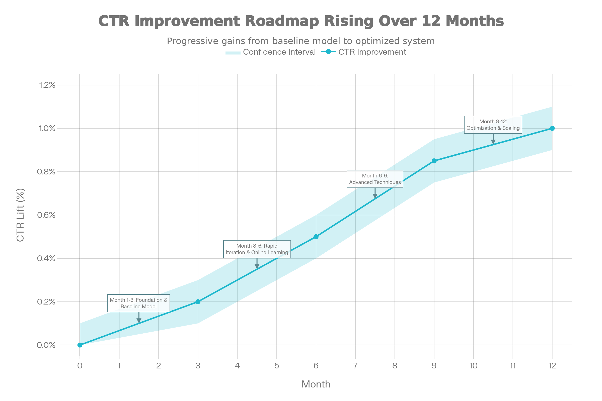
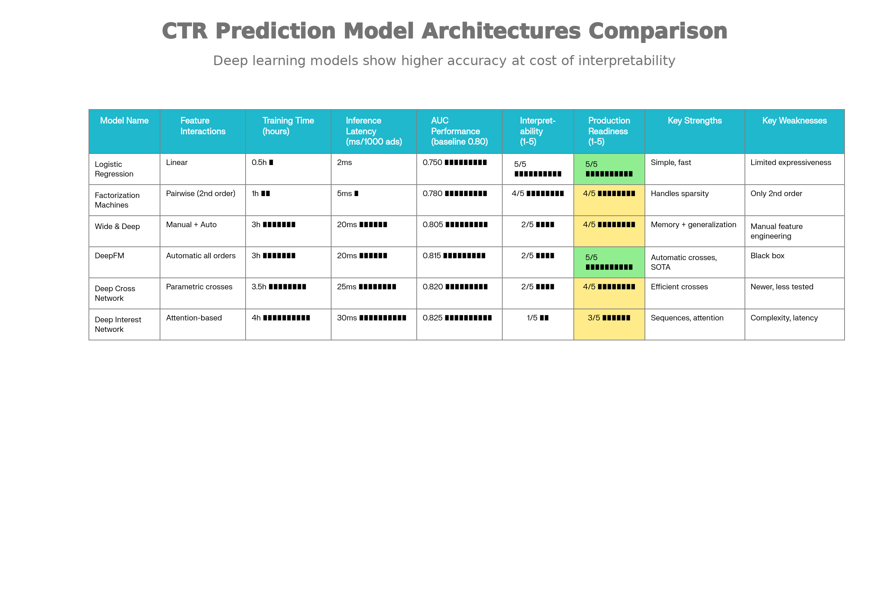

# ML System Design Interview: Ad Click Predictor for Meta - Comprehensive Guide

I've prepared an in-depth, interview-style dialogue document for your Meta Senior Data Scientist preparation focused on building an ad click prediction system. Here's what I've created:

## 📋 Complete Interview Format Document

The document is structured as a **realistic dialogue between an experienced interviewer and candidate**, progressing through 6 major phases:

### **Phase 1: Clarification \& Requirements Gathering** [^1_1][^1_2][^1_3]

- Latency constraints (50-100ms end-to-end)
- Business metrics alignment (CTR, CVR, user satisfaction)
- Data scale (100M users, 10B daily impressions, 1-2% CTR)
- Feature scope and data challenges
- Training data requirements and class imbalance handling


### **Phase 2: High-Level Architecture**

Shows the complete system with:

- Data pipelines (batch + streaming features)
- Training pipeline (GPU clusters, daily retraining)
- Serving pipeline (two-stage: pre-ranker + main ranker)
- Monitoring and feedback loops


### **Phase 3: Deep Dive - Data Pipeline \& Feature Engineering** [^1_4][^1_5]

- Feature store design (batch on S3, online in Redis)
- Feature freshness management
- Nearline Feature Attribution to solve training-serving skew (like LinkedIn's approach)
- FeatureBox optimization: 5-10X speedup through GPU pipelining


### **Phase 4: Deep Dive - Model Architecture** [^1_6][^1_7][^1_8][^1_9][^1_10]

**Model progression:**

- Traditional approach: Logistic Regression + Decision Trees (Facebook's paper)
- Shallow models: Factorization Machines (FM)
- Modern deep learning: **DeepFM** (recommended baseline)
    - Combines FM part (explicit 2nd-order interactions) with DNN part (implicit high-order)
    - Training specs: 3-4 hours on 300B downsampled examples with 64 A100 GPUs
    - Expected AUC: 0.815-0.825 on test set
- Advanced: Deep Interest Network (DIN) for sequence-based predictions
- Practical comparison with mathematical formulations and implementation details


### **Phase 5: Model Serving \& Inference Optimization** [^1_9][^1_11][^1_12][^1_13]

**Two-stage ranking with two-tower embeddings:**

- Stage 1 (10-15ms): Lightweight candidate generation using ANN index
- Stage 2 (20-40ms): Deep CTR model scoring on 1000 candidates
- Stage 3 (10-20ms): Reranking with business constraints
- Two-Tower architecture for efficient retrieval:
    - Offline: pre-compute ad embeddings, store in ANN index
    - Online: compute user embedding, query for similar ads
    - Batch inference optimization, GPU parallelization


### **Phase 6: Model Evaluation \& Monitoring** [^1_14][^1_15]

**Offline metrics:**

- AUC (Area Under ROC): primary metric, robust to class imbalance
- Log Loss: probability calibration metric
- O/E Ratio (Observed-to-Expected): calibration per decile

**Online evaluation:**

- A/B testing framework (50-50 split, 7+ days)
- Chi-square statistical testing
- Guardrail metrics: user engagement, advertiser satisfaction
- Gradual rollout strategy

**Production monitoring:**

- Real-time dashboards: CTR, calibration, data drift
- Anomaly detection: isolation forests
- Debug procedures: data integrity → distribution shift → model validation


### **Production Challenges \& Solutions** [^1_14][^1_15]

The dialogue covers real-world production issues:

1. **Feature Consistency** → Nearline Feature Attribution
2. **Delayed Feedback** → Delayed feedback loss functions (Twitter's approach)
3. **Model Staleness** → Online incremental learning (LinkedIn's hourly training)
4. **Calibration at Scale** → Online calibration pipelines
5. **Cold-Start** → Meta-learning, transfer learning, segment-based averaging
6. **Computational Efficiency** → Model quantization, batch inference, GPU servers
7. **Adversarial Behavior** → Fraud detection, click pattern analysis

### **Year 1 Roadmap**

**Month 1-3 (Foundation):** +0.2% CTR lift (\$5M impact)

- Establish baseline model and metrics
- Build feature store and nearline pipeline

**Month 3-6 (Rapid Iteration):** +0.5% cumulative CTR lift (\$12M impact)

- Deep Interest Network attention mechanism
- Multi-task learning (CTR + CVR)
- Online incremental learning

**Month 6-12 (Advanced):** +1.0% cumulative CTR lift (\$25M impact)

- Contextual bandits for exploration
- Graph neural networks for user-ad relationships
- Federated learning for privacy
- Reinforcement learning for long-term objectives


## 📊 Supporting Visualizations

I've created 4 technical diagrams:

**System Architecture:** Complete end-to-end pipeline showing data ingestion, training, serving, and monitoring

 

End-to-end Ad CTR Prediction System Architecture with Data, Training, and Serving Pipelines

**DeepFM Model:** Detailed architecture showing feature embedding, FM part, DNN part, and output layers

 

DeepFM Model Architecture: Combining Factorization Machines with Deep Neural Networks

**Two-Tower Embeddings:** User and ad towers producing embeddings for efficient ANN retrieval

 

Two-Tower Embedding Architecture for Efficient Candidate Generation and Ranking

**CTR Improvement Roadmap:** 12-month timeline showing cumulative improvements and revenue impact

 

CTR Improvement Roadmap and Revenue Impact Over 12 Months

**Model Architecture Comparison:** Trade-offs between 6 architectures (Logistic Regression, FM, Wide\&Deep, DeepFM, DCN, DIN)

 

Comparison of CTR Model Architectures: Performance vs. Complexity Trade-offs

## 🎯 Key Technical Depth

The dialogue includes:

- **Mathematical formulations** for loss functions, AUC calculation, calibration
- **Real company examples**: Facebook's Logistic Regression + Decision Trees paper, LinkedIn's nearline training, Alibaba's DIN, Twitter's delayed feedback handling, Baidu's FeatureBox
- **Production complexity**: feature latency, batch vs. online features, caching strategies
- **Evaluation rigor**: offline metrics, online A/B testing, statistical significance, guardrail metrics
- **Optimization techniques**: model quantization, batch inference, ANN search, GPU pipelining


## 💡 Interview Strategy Tips

The document models:

- **Asking clarifying questions first** (latency, scale, metrics)
- **Stating assumptions explicitly** (100M users, 1-2% CTR baseline)
- **Progressive disclosure** (high-level before details)
- **Trade-off thinking** (speed vs. accuracy, complexity vs. interpretability)
- **Production-aware design** (caching, monitoring, A/B testing)
- **Numerical reasoning** (infrastructure costs, training time calculations)
- **Prioritization** (building foundation before advanced techniques)

This dialogue is modeled after real Meta interview feedback and incorporates insights from academic papers, production systems from Meta, LinkedIn, Uber, and other tech companies that publish their approaches.[^1_2][^1_16][^1_3][^1_17][^1_5][^1_14]
<span style="display:none">[^1_18][^1_19][^1_20][^1_21][^1_22][^1_23][^1_24][^1_25][^1_26][^1_27][^1_28][^1_29][^1_30][^1_31][^1_32][^1_33][^1_34][^1_35][^1_36][^1_37][^1_38][^1_39][^1_40][^1_41][^1_42][^1_43][^1_44][^1_45][^1_46][^1_47][^1_48][^1_49][^1_50][^1_51][^1_52][^1_53][^1_54][^1_55][^1_56][^1_57][^1_58][^1_59][^1_60][^1_61][^1_62][^1_63][^1_64]</span>

<div align="center">⁂</div>

```text
[^1_1]: https://www.linkedin.com/pulse/building-ad-click-prediction-machine-learning-3tlic 
[^1_2]: https://igotanoffer.com/blogs/tech/facebook-data-scientist-interview 
[^1_3]: https://www.interviewquery.com/interview-guides/facebook-data-scientist 
[^1_4]: https://arxiv.org/pdf/2210.07768.pdf 
[^1_5]: https://ai.meta.com/research/publications/practical-lessons-from-predicting-clicks-on-ads-at-facebook/ 
[^1_6]: https://arxiv.org/pdf/1703.04247.pdf 
[^1_7]: https://arxiv.org/pdf/1804.04950.pdf 
[^1_8]: https://peerj.com/articles/cs-716 
[^1_9]: https://blog.reachsumit.com/posts/2023/03/two-tower-model/ 
[^1_10]: https://arxiv.org/pdf/1706.06978.pdf 
[^1_11]: https://www.linkedin.com/pulse/understanding-two-tower-acrhitecture-building-systems-aayush-agrawal-bllif 
[^1_12]: https://www.shaped.ai/blog/the-two-tower-model-for-recommendation-systems-a-deep-dive 
[^1_13]: https://docs.cloud.google.com/architecture/implement-two-tower-retrieval-large-scale-candidate-generation 
[^1_14]: https://www.linkedin.com/blog/engineering/infrastructure/incremental-and-online-training-platform-at-linkedin 
[^1_15]: https://arxiv.org/pdf/1907.06558.pdf 
[^1_16]: https://prepfully.com/interview-guides/meta-data-scientist 
[^1_17]: https://research.facebook.com/publications/practical-lessons-from-predicting-clicks-on-ads-at-facebook/ 
[^1_18]: https://www.ijeat.org/wp-content/uploads/papers/v9i3/C5518029320.pdf 
[^1_19]: https://www.ijeat.org/portfolio-item/F9366088619/ 
[^1_20]: https://www.ewadirect.com/proceedings/ace/article/view/24499 
[^1_21]: https://link.springer.com/10.1007/s41939-024-00463-x 
[^1_22]: https://ieeexplore.ieee.org/document/10441187/ 
[^1_23]: https://www.nature.com/articles/s41377-023-01218-y 
[^1_24]: https://ieeexplore.ieee.org/document/10639163/ 
[^1_25]: https://ijdm.org.ng/index.php/Journals/article/view/77 
[^1_26]: http://medrxiv.org/lookup/doi/10.1101/2024.10.27.24316215 
[^1_27]: https://bioelecmed.biomedcentral.com/articles/10.1186/s42234-024-00156-3 
[^1_28]: https://arxiv.org/pdf/2209.05310.pdf 
[^1_29]: http://arxiv.org/pdf/1707.00802.pdf 
[^1_30]: https://arxiv.org/pdf/1904.11547.pdf 
[^1_31]: http://arxiv.org/pdf/2308.01231.pdf 
[^1_32]: https://linkinghub.elsevier.com/retrieve/pii/S2667305323000108 
[^1_33]: http://arxiv.org/pdf/2406.16221.pdf 
[^1_34]: https://downloads.hindawi.com/journals/sp/2023/1217898.pdf 
[^1_35]: http://arno.uvt.nl/show.cgi?fid=189804 
[^1_36]: https://www.youtube.com/watch?v=D2g_P0z9z1o 
[^1_37]: https://ijarcce.com/wp-content/uploads/2025/09/IJARCCE.2025.14816.pdf 
[^1_38]: https://madgicx.com/blog/predictive-meta-ad-optimization 
[^1_39]: https://www.sciencedirect.com/science/article/abs/pii/S0378720625000801 
[^1_40]: https://www.cambridge.org/core/journals/knowledge-engineering-review/article/comprehensive-survey-on-advertising-clickthrough-rate-prediction-algorithm/C11C54F5D365D280A58CE051D9B52DE6 
[^1_41]: https://www.datainterview.com/blog/meta-data-scientist-interview 
[^1_42]: https://www.geeksforgeeks.org/machine-learning/click-through-rate-prediction/ 
[^1_43]: https://datalemur.com/blog/meta-data-scientist-interview-guide 
[^1_44]: https://github.com/aniass/ad-click-prediction 
[^1_45]: https://ieeexplore.ieee.org/document/11164097/ 
[^1_46]: https://prepfully.com/interview-questions/meta/data-scientist 
[^1_47]: https://engineering.fb.com/2024/07/10/data-infrastructure/machine-learning-ml-prediction-robustness-meta/ 
[^1_48]: https://arxiv.org/abs/2109.02398 
[^1_49]: https://arxiv.org/pdf/1905.06336.pdf 
[^1_50]: https://pmc.ncbi.nlm.nih.gov/articles/PMC8459778/ 
[^1_51]: https://arxiv.org/pdf/2104.01924.pdf 
[^1_52]: https://arxiv.org/pdf/2304.00902.pdf 
[^1_53]: https://www.mdpi.com/2079-9292/9/2/350/pdf 
[^1_54]: https://pmc.ncbi.nlm.nih.gov/articles/PMC10048037/ 
[^1_55]: https://onlinelibrary.wiley.com/doi/10.1155/2021/5575249 
[^1_56]: https://www.youtube.com/watch?v=7l0HLYVFEuU 
[^1_57]: https://www.sciencedirect.com/science/article/abs/pii/S0957417424021237 
[^1_58]: https://www.semanticscholar.org/paper/Deep-interaction-network-based-CTR-prediction-model-Zhang-Wang/4e8fdb5df4d1dc16506d95cf6b9d9811e5ba801c 
[^1_59]: https://www.tredence.com/blog/understanding-the-twotower-architecture-in-recommendation-systems 
[^1_60]: https://www.kaggle.com/code/babatundezenith/click-through-rate-ctr-prediction 
[^1_61]: https://www.nature.com/articles/s41598-025-99671-9 
[^1_62]: https://www.uber.com/en-IN/blog/innovative-recommendation-applications-using-two-tower-embeddings/ 
[^1_63]: https://dl.acm.org/doi/fullHtml/10.1145/3446132.3446134 
[^1_64]: https://www.hopsworks.ai/dictionary/two-tower-embedding-model 
```