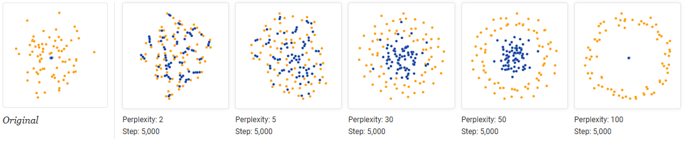
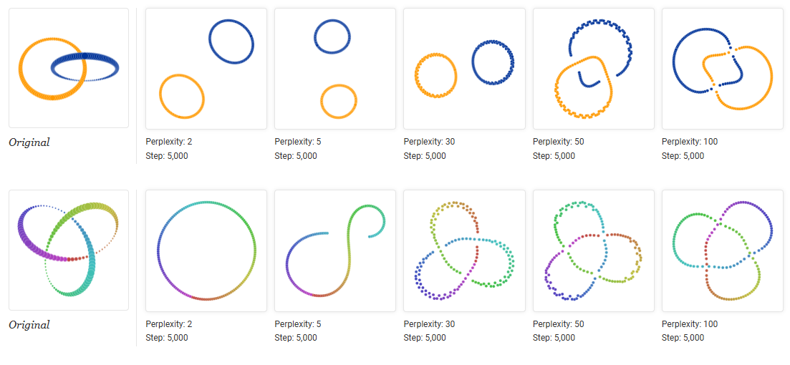

# Notes from Martin Wattenberg and Feranda Viegas's blog titled 'How to Use t-SNE Effectively' <https://distill.pub/2016/misread-tsne/>

All credits to them!

> Although extremely useful for visualizing high-dimensional data, t-SNE plots can sometimes be mysterious or misleading. By exploring how it behaves in simple cases, we can learn to use it more effectively.

- The algorithm is non-linear and adapts to the underlying data, performing different transformations on different regions.
- Hyperparameter *perplexity*, which says (loosely) how to balance attention between local and global aspects of your data. The parameter is, in a sense, a guess about the number of close neighbors each point has. **The perplexity value has a complex effect on the resulting pictures.** The original paper says, *The performance of SNE is fairly robust to changes in the perplexity, and typical values are between 5 and 50.* But the story is more nuanced than that.
- The t-SNE algorithm doesn't always produce similar output on successive runs, for example, and there are additional hyperparameters related to the optimization process.

## Hyperparams really matter

## Cluster sizes in a t-SNE plot mean nothing

## Distances between clusters might not mean anything

## Random noise doesn’t always look random

## You can see some shapes, sometimes

## For topology, you may need more than one plot

The plots below show two groups of 75 points in 50 dimensional space. Both are sampled from symmetric Gaussian distributions centered at the origin, but one is 50 times more tightly dispersed than the other. The *small* distribution is in effect contained in the large one.

Consider a set of points that trace a link or a knot in three dimensions.

> **Once again, looking at multiple perplexity values gives the most complete picture.**

Low perplexity values give two completely separate loops; high ones show a kind of global connectivity.

